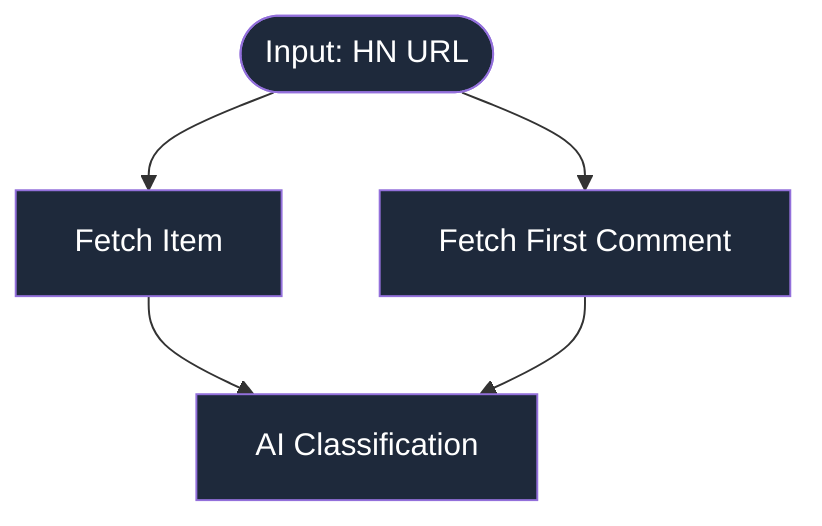

# pgflow Starter - HackerNews Classifier

This repository contains a starter example for [pgflow](https://www.pgflow.dev/), a workflow orchestration system that runs inside your Supabase Postgres database. It shows how to classify HackerNews posts using OpenAI models.

The example demonstrates how to replay historical inputs against modified workflow steps - useful for testing how changes to prompts, models, or logic affect outputs without re-fetching source data. This makes it easy to iterate on AI workflows and compare results across different configurations.

For detailed documentation, architecture overview, and advanced usage, see the [Full README](./README_FULL.md).

## Flow Architecture



**Source files:** [Flow Definition](./supabase/functions/_flows/classifyHnItem.ts) | [Original Classify Task](./supabase/functions/_tasks/classify.ts) | [Model-Parametrized Version](./supabase/functions/_tasks/classifyV2.ts)

# Quick Start

## Setup
```bash
cd supabase/functions && cp .env.example .env
# Add: OPENAI_API_KEY, EDGE_WORKER_DB_URL (from supabase status)

npx -y supabase@latest start
npx -y supabase@latest functions serve
```

Wait 3s for pg_cron to start the worker.

## Run Classification
```sql
SELECT * FROM pgflow.start_flow(
  flow_slug => 'classifyHnItem',
  input => jsonb_build_object('url','https://news.ycombinator.com/item?id=45245948')
);
```

## Batch Process
```sql
WITH urls AS (
  SELECT unnest(ARRAY[
    'https://news.ycombinator.com/item?id=45247890',
    'https://news.ycombinator.com/item?id=45248802',
    'https://news.ycombinator.com/item?id=45223827',
    'https://news.ycombinator.com/item?id=45246953',
    'https://news.ycombinator.com/item?id=45245948',
    'https://news.ycombinator.com/item?id=45243635',
    'https://news.ycombinator.com/item?id=45221023',
    'https://news.ycombinator.com/item?id=45226938',
    'https://news.ycombinator.com/item?id=45246403',
    'https://news.ycombinator.com/item?id=45243803'
  ]) AS url
)
SELECT pgflow.start_flow(
  flow_slug => 'classifyHnItem',
  input => jsonb_build_object('url', url)
) FROM urls;
```

## Check Results
```sql
-- Recent runs
SELECT flow_slug, status, output->'classification'
FROM pgflow.runs
ORDER BY started_at DESC LIMIT 10;

-- Completed classifications
SELECT input->>'url', output->'classification'
FROM pgflow.runs
WHERE flow_slug = 'classifyHnItem' AND status = 'completed';
```

[→ Monitor flow execution (pgflow.dev)](https://www.pgflow.dev/how-to/monitor-flow-execution/)

## Clear to start from scratch

```sql
SELECT pgflow.prune_data_older_than(make_interval(days => 0));
```

## Compare Models
```bash
npm run compare
# or
npm run compare:limit -- --limit 10
```

The compare script demonstrates pgflow's replay capability with no magic - it simply:
1. Loads past run inputs with a single SQL query
2. Calls the classification step directly with those inputs
3. Compares outputs from different models (gpt-5-nano/mini/gpt5)

This lets you test how prompt or model changes affect outputs without re-fetching data or modifying the database.

---

[Full README](./README_FULL.md) | [pgflow.dev](https://www.pgflow.dev/)
