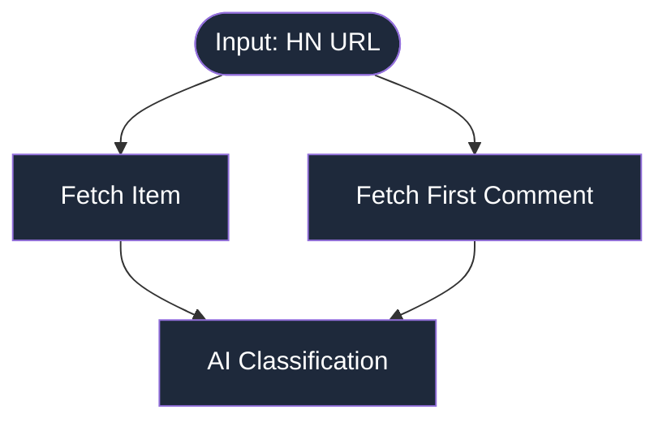

# HN Item Classifier with pgflow

A demonstration of [pgflow](https://www.pgflow.dev/) - a workflow engine for Supabase that uses a functional approach to decompose complex workflows into small, testable functions.

This project classifies Hacker News items by fetching the item details and first comment, then using LLM classification to determine if the content is AI-related, assign a hype meter score, and add relevant tags.

## Flow Architecture



**Source files:** [Flow Definition](./supabase/functions/_flows/classifyHnItem.ts) | [Original Classify Task](./supabase/functions/_tasks/classify.ts) | [Model-Parametrized Version](./supabase/functions/_tasks/classifyV2.ts)

## Setup (one time)

### 1. Copy .env.example to .env and fill it in

```bash
cd supabase/functions
cp .env.example .env
```

Set the following environment variables:
- `OPENAI_API_KEY`: Your OpenAI API key for classification
- `EDGE_WORKER_DB_URL`: Postgres connection string (get from `npx -y supabase@latest status`)

### 2. Start Supabase

```bash
npx -y supabase@latest start
```

This will start the local Supabase stack and automatically run the pgflow migrations.

### 3. Start Worker

Start the edge function worker:

```bash
npx -y supabase@latest functions serve
```

Wait 3s for pg_cron to start the worker.

The edge worker runs as an edge function and keeps the pgflow worker process running as long as possible. Edge functions were the first JS runtime targeted by pgflow, with plans to port to Node.js for long-lived processes.

## Start a Run via SQL Query

Execute a classification flow with this SQL query:

```sql
SELECT * FROM pgflow.start_flow(
  flow_slug => 'classifyHnItem',
  input => jsonb_build_object('url','https://news.ycombinator.com/item?id=45245948')
);
```

1. Run this query in your Supabase Studio or psql
2. Observe the worker output in your terminal
3. After completion, check the run status and output

Once all steps complete, `pgflow.runs.output` will automatically contain the leaf step output:

```json
{
  "classification": {
    "isAiRelated": true,
    "hypeMeter": 8,
    "tags": ["AI", "LLM", "OpenAI"]
  }
}
```

Query all completed runs with their inputs and classifications:

```sql
SELECT
  r.input->>'url' as url,
  r.output->'classification' as classification,
  r.status
FROM pgflow.runs r
WHERE r.flow_slug = 'classifyHnItem'
  AND r.status = 'completed';
```

## Batch Processing Multiple URLs

Start multiple classification runs in parallel with a single query:

```sql
WITH urls AS (
  SELECT unnest(ARRAY[
    'https://news.ycombinator.com/item?id=45247890',
    'https://news.ycombinator.com/item?id=45248802',
    'https://news.ycombinator.com/item?id=45223827',
    'https://news.ycombinator.com/item?id=45246953',
    'https://news.ycombinator.com/item?id=45245948',
    'https://news.ycombinator.com/item?id=45243635',
    'https://news.ycombinator.com/item?id=45221023',
    'https://news.ycombinator.com/item?id=45226938',
    'https://news.ycombinator.com/item?id=45246403',
    'https://news.ycombinator.com/item?id=45243803',
    'https://news.ycombinator.com/item?id=45225903',
    'https://news.ycombinator.com/item?id=45245678',
    'https://news.ycombinator.com/item?id=45221112',
    'https://news.ycombinator.com/item?id=45216327',
    'https://news.ycombinator.com/item?id=45204587'
  ]) AS url
)
SELECT pgflow.start_flow(
  flow_slug => 'classifyHnItem',
  input => jsonb_build_object('url', url)
) AS run_id, url
FROM urls;
```

This will start 15 parallel classification runs. Monitor their progress:

```sql
-- Watch runs complete in real-time
SELECT
  r.run_id,
  r.input->>'url' as url,
  r.status,
  r.output->'classification'->>'isAiRelated' as ai_related,
  r.output->'classification'->>'hypeMeter' as hype,
  r.started_at,
  r.completed_at
FROM pgflow.runs r
WHERE r.flow_slug = 'classifyHnItem'
  AND r.started_at > NOW() - INTERVAL '5 minutes'
ORDER BY r.started_at DESC;
```

## Clear to start from scratch

```sql
SELECT pgflow.prune_data_older_than(make_interval(days => 0));
```

## Monitoring

Monitor your flows with these essential queries:

### View recent runs with their status

```sql
SELECT flow_slug, status, started_at, started_at, completed_at
FROM pgflow.runs
ORDER BY started_at DESC
LIMIT 10;

-- Expanded display is used automatically.
--    flow_slug    |  status   |          started_at           |          started_at           |         completed_at          
-- ----------------+-----------+-------------------------------+-------------------------------+-------------------------------
--  classifyHnItem | completed | 2025-09-15 13:57:04.691987+00 | 2025-09-15 13:57:04.691987+00 | 2025-09-15 13:57:06.795428+00
--  classifyHnItem | completed | 2025-09-15 13:55:44.659637+00 | 2025-09-15 13:55:44.659637+00 | 2025-09-15 13:55:47.226288+00
```

### Check failed runs and their errors

```sql
SELECT r.flow_slug, r.input, st.step_slug, st.error_message
FROM pgflow.runs r
JOIN pgflow.step_tasks st ON r.run_id = st.run_id
WHERE r.status = 'failed'
ORDER BY r.started_at DESC;

--  flow_slug | input | step_slug | error_message 
-- -----------+-------+-----------+---------------
```

### Monitor step execution times

```sql
SELECT
  r.flow_slug,
  st.step_slug,
  AVG(EXTRACT(EPOCH FROM (st.completed_at - st.started_at))) as avg_duration_seconds
FROM pgflow.runs r
JOIN pgflow.step_tasks st ON r.run_id = st.run_id
WHERE st.status = 'completed'
GROUP BY r.flow_slug, st.step_slug
ORDER BY avg_duration_seconds DESC;

-- Null display is "[NULL]".
-- Expanded display is used automatically.
--    flow_slug    |   step_slug    |  avg_duration_seconds  
-- ----------------+----------------+------------------------
--  classifyHnItem | classification |     1.7894370000000000
--  classifyHnItem | firstComment   | 0.46038100000000000000
--  classifyHnItem | item           | 0.31217150000000000000
-- (3 rows)
```

For comprehensive monitoring, see [Monitor flow execution | pgflow](https://www.pgflow.dev/how-to/monitor-flow-execution/).

## Classification Tasks

### Model Evolution

- **v1 (classify.ts)**: Uses `gpt-5-mini` with the original conservative prompt for production classification
- **v2 (classifyV2.ts)**: Enhanced prompt with detailed rubric, used for comparison testing

## The Compare Script

Test classification consistency across different GPT-5 models using the enhanced v2 prompt:

```bash
npm run compare
# or with custom limit
npm run compare:limit -- --limit 10
```

**What it does:**

1. Loads historical classification data from the database
2. Runs the enhanced v2 prompt with three GPT-5 models in parallel:
   - `gpt-5-nano` - Fastest, most cost-effective
   - `gpt-5-mini` - Balanced performance (production default)
   - `gpt-5` - Most capable model
3. Compares results across all models to identify consensus and disagreements
4. No database writes - purely for evaluation

**Sample output:**
```
📊 Classification Results:
----------------------------------------------------------------------
isAiRelated:
  stored: ✓
  nano:   ✓
  mini:   ✓
  gpt5:   ✓

hypeMeter:
  stored: 5
  nano:   4
  mini:   5
  gpt5:   6

tags:
  stored: ["AI", "GPT", "benchmark"]
  nano:   ["LLM", "evaluation", "benchmark"]
  mini:   ["LLM", "evaluation", "performance"]
  gpt5:   ["language model", "benchmark", "GPT-4"]
```

**Summary Table (for multiple runs):**
- Shows AI classification consensus across models
- Tracks average hype meter differences
- Identifies when models disagree on classifications
- Provides clickable URLs for manual verification

This comparison helps evaluate:
- Prompt improvements (v2's detailed rubric vs v1's simple approach)
- Model consistency (how different GPT-5 variants classify the same content)
- Classification drift over time

## Production Notes

In production environments, you would export datapoints as JSONL files rather than querying the database directly. These comparisons can run in CI pipelines with results stored like code coverage reports, or pushed to monitoring systems like Grafana. For automated scoring beyond human eyeballing, add an LLM-as-judge system to evaluate disagreements.

## No Lock-in: Portable Functions

pgflow's functional approach makes migration straightforward. Here's how the same tasks would work in Inngest:

```typescript
// Same task functions, different orchestration
import { inngest } from "./inngest";
import { fetchHnItem, fetchHnFirstComment, classify } from "./_tasks";

export const classifyHnItemInngest = inngest.createFunction(
  { id: "classify-hn-item" },
  { event: "hn.classify" },
  async ({ event, step }) => {
    const { url } = event.data;

    const [item, firstComment] = await Promise.all([
      step.run("fetch-item", () => fetchHnItem({ url })),
      step.run("fetch-comment", () => fetchHnFirstComment({ url }))
    ]);

    return await step.run("classify", () =>
      classify({ item, firstComment, run: { id: event.data.runId } })
    );
  }
);
```

*Note: Not tested on Inngestillustrative only.*

## Roadmap

### Very soon:
- `array.map` for parallel processing of arrays
- Human-in-the-loop steps (approval, surveys, waiting for input)
- Per-step queue selection for production scaling across multiple workers

### 1-2 months:
- Full dependency injection for step handlers ([Context Object](https://www.pgflow.dev/concepts/context/))
- Conditional execution of branches based on JSON matching or TypeScript callbacks
- Subflow embedding for reusability and composability

### Near future:
- Node worker for long-running tasks alongside edge functions
- Multi-language flows: Python ML workers with Node orchestration
- Hosted Worker offering
- Observability UI dashboard (planned paid product)

---

For more information, visit [pgflow.dev](https://www.pgflow.dev/)
